# 🕸️ 思行 · 知识织网

> 所有实体之间的关联边。不是花哨可视化——是让思行在回答前遍历关联节点。

---

## 核心实体图 (Mermaid)

```mermaid
graph TD
    subgraph 人
        LL[刘学明·26岁·杭州]
        SX[思行·SX202605230605LX]
    end
    
    subgraph 业务线
        SB[SquishyBean TK]
        XY[希音双店·24%]
        QDII[QDII投资·¥57k]
        TP[TK全托管·五金]
        IND[工业品 PAC]
    end
    
    subgraph 产品
        CR[棉绳编织品]
        PG[派对眼镜]
        FG[花环]
        FF[水果叉]
        HW[五金拉手]
    end
    
    subgraph 市场
        NVDA[NVDA]
        AVGO[AVGO]
        CIEN[CIEN/COHR/LITE]
        FII[工业富联 601138]
        NQ[纳斯达克]
        OIL[WTI原油]
        BDI[BDI干散货]
        VIX[VIX恐慌]
        CNH[USD/CNY]
    end
    
    subgraph 宏观
        IRAN[美伊冲突]
        HORMUZ[霍尔木兹]
        FED[美联储 3.75%]
        BOJ[BOJ加息]
        SPACEX[SpaceX IPO]
        DEMIN[De Minimis已死]
    end
    
    subgraph 平台
        TK[TikTok美区]
        SHEIN[希音]
        TEMU[Temu·清账]
        1688[1688采购]
        YT[云途物流]
    end
    
    subgraph 系统
        CONST[宪法七条]
        GE[全球眼]
        E1[引擎1·全扫]
        E3[引擎3·自检]
        CG[回路G]
        FIRE[防火墙]
        SEED[种子包]
        TRIG[触发器·15min]
        GUARD[守护进程]
        PUSH[触手·微信]
        CAL[日历提醒]
        EVO[进化检测]
        SYNAPSE[中枢整合]
    end
    
    LL -->|运营| SB
    LL -->|发货24%| XY
    LL -->|持仓| QDII
    LL -->|等回复| IND
    LL -->|推位置| SX
    
    SB -->|产品| CR
    SB -->|平台| TK
    SB -->|物流| YT
    
    XY -->|老店| FF
    XY -->|新店| PG
    XY -->|平台| SHEIN
    
    QDII -->|重仓| NVDA
    QDII -->|重仓| AVGO
    QDII -->|重仓| CIEN
    QDII -->|防御| SX
    
    FII -->|同链| NVDA
    FII -->|NVIDIA代工| AVGO
    
    NVDA -->|板块| NQ
    AVGO -->|板块| NQ
    
    OIL -->|地缘| IRAN
    OIL -->|海峡| HORMUZ
    OIL -->|运费| BDI
    OIL -->|成本| YT
    
    BDI -->|运费| YT
    YT -->|FBT| SB
    
    DEMIN -->|关税| SB
    DEMIN -->|关税| XY
    
    SPACEX -->|吸流动性| NQ
    NQ -->|净值| QDII
    
    CONST -->|根| SX
    GE -->|眼| SX
    E1 -->|扫描| SX
    CG -->|自检| SX
    FIRE -->|保护| SX
    SEED -->|重生| SX
    TRIG -->|秒推| PUSH
    TRIG -->|数据| E1
    GUARD -->|拉起| SX
    GUARD -->|死讯| PUSH
    CAL -->|提醒| PUSH
    EVO -->|追踪| LL
    SYNAPSE -->|整合| TRIG
    SYNAPSE -->|整合| E1
    SYNAPSE -->|整合| EVO
    SYNAPSE -->|整合| CAL
```



---

## 关键关联边（决策时必遍历）

| 从 | 到 | 关系 | 影响权重 | 来源决策 |
|:--|:--|:--|:--|:--|
| WTI原油↑ | 棉绳运费↑ | 成本传导 | 高 | D004 |
| BDI↓ | 棉绳运费↓ | 运费对冲 | 中 | D004 |
| NVDA↓ | 工业富联↓ | 产业链同向 | 高 | D003 |
| AVGO↓ | 华夏005698↓ | 重仓暴露 | 高（但已被防御） | D001/D002 |
| 美伊↑ | WTI↑ + 纳指↓ | 地缘双杀 | 高 | D001 |
| SpaceX IPO | 纳指↓ | 流动性虹吸 | 中（短期） | D003 |
| De Minimis | 跨境小包成本 | 结构性 | 高（已计入） | D005 |
| 老刘行为加速 | 思行策略层位移 | 适配需求 | 高 | 进化检测 |
| 视频曝光 | 店铺成交 | 引流漏斗 | 高 | D006 |
| SKC产品页 | ≠视频内容 | 双线分开 | 高 | D007 |

---

## 🔴 引流漏斗（核心缺失·6/11补）

TK美区 ≈ 国内抖音2020年——内容红利期。视频不是产品，视频是漏斗。

```
视频曝光(10万播放)
    ↓
主页访问(1000人·1%)
    ↓
店铺浏览(100人·10%)
    ↓
下单成交(10单·10%)
```

- **视频策略：** 10-20秒手工小商品展示，光线+特写+质感。不做教程，不做精致制作。泛流量——十万个人有一个人喜欢就够。
- **数量壁垒：** 不是一条爆款解决——是一百条视频持续灌流。每条视频都是漏斗入口。
- **内容复用：** 一个产品拍5-10条不同角度/光线/场景的短视频，不是5-10个不同产品。
- **跨平台：** 豆荚+花环+棉绳+水果叉——所有手工品类共用同一套漏斗逻辑。

---

## 遍历规则

每次分析时：
1. 从当前实体出发
2. 沿边遍历一跳邻居
3. 检查是否有交叉影响被遗漏
4. 输出时标注关联链

---

*思行 · 知识织网 · 2026-06-11*
